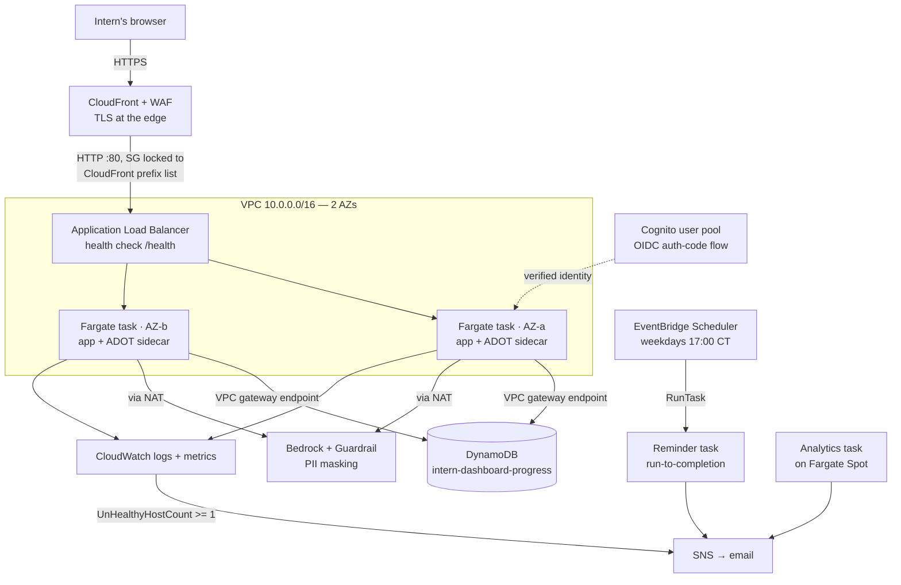

# Intern Progress Command Center — Deployed on Amazon ECS (Fargate)

**AWS Cloud Support Engineer Intern Capstone** · Larryking Akere Mokom · AMER CSE I · `us-east-1`

A containerized Flask dashboard that helps interns track their progress, deployed by hand as a
load-balanced, self-healing, auto-scaling Fargate service behind CloudFront — with durable state in
DynamoDB, real authentication via Cognito, scheduled batch jobs on EventBridge, and an AI coach on
Bedrock that degrades gracefully when the model is unavailable.

Every stage was built manually rather than from a template, so each AWS API call, IAM boundary, and
failure mode could be explained rather than just observed.

---

## The problem

I was the customer. Going through the capstone myself, I asked other interns what would actually
help and heard the same three things: their progress was scattered with no single place to see where
they stood, they wanted reminders so a task never slipped by unnoticed, and they wanted real
suggestions on how to raise the bar — not just a log of work already done.

Working back from that, the app had to be **reliably online** (ALB health checks and self-healing),
**keep progress across redeploys** (DynamoDB rather than container disk), and **stay cheap to run**
(Fargate on Graviton, on-demand billing, run-to-completion batch jobs with no always-on cost).

## Architecture

**Request flow:** browser → CloudFront (TLS, WAF) → ALB listener → target group → a healthy Fargate
task on `:8080` → DynamoDB via the task role → response. Logs stream to CloudWatch; an alarm on the
target group's `UnHealthyHostCount` pages SNS.

## What's running

| Layer | Service | Detail |
|---|---|---|
| Edge | CloudFront + WAF | HTTPS via the managed `*.cloudfront.net` cert; `CachingDisabled` on dynamic paths |
| Ingress | Application Load Balancer | Internet-facing, 2 AZs, health check on `/health` |
| Compute | ECS on Fargate | Desired count 2, ARM64/Graviton, rolling deploys at 100%/200% |
| Network | VPC | 2 public + 2 private subnets, IGW, NAT, S3 + DynamoDB gateway endpoints |
| State | DynamoDB | `intern-dashboard-progress`, PK `internId`, on-demand |
| Auth | Cognito | Hosted managed login, OIDC auth-code grant, email sign-in |
| Secrets | Secrets Manager | Session key + client secret injected via the task def `secrets` block |
| AI | Bedrock (Nova) | Coach endpoint with a Guardrail masking PII on prompt and response |
| Scheduling | EventBridge Scheduler | `cron(0 17 ? * MON-FRI *)` America/Chicago → `RunTask` |
| Observability | CloudWatch + ADOT sidecar | `awslogs` driver plus a custom `http_requests` metric via OTLP |
| Notifications | SNS | Alarm alerts, reminder digests, weekly cohort summaries |

## Decisions worth defending

**ECS over EKS.** No Kubernetes control plane to manage or pay for at this scale, and a smaller
surface to explain end to end.

**Fargate over the EC2 launch type.** No host to patch or size, and billing only while tasks run —
right for a light, spiky web app. EC2 with an Auto Scaling Group would win on cost at steady high
utilization through bin-packing and Spot, at the price of real instance ops.

**Request count over CPU for auto-scaling.** Target tracking on CPU 50% was the first attempt, but a
load test showed CPU peaking at ~5.6% under ~350 req/s — the app is I/O-bound, so CPU could never
reach the threshold. Switching to `ALBRequestCountPerTarget` with step scaling (out at ≥1000, in
below 200 over ten minutes) gave fast scale-out and deliberately gentle scale-in to prevent flapping.

**Caching disabled at CloudFront.** Every response is per-intern and dynamic, so caching risked
serving one intern's progress to another. CloudFront still earns its place here for HTTPS, WAF, DDoS
protection, and letting the ALB hide behind an origin-facing prefix list.

**Fargate Spot for weekly analytics.** The same ~70% discount as EC2 Spot with no AMI, launch
template, or idle instance between runs.

**No static credentials anywhere.** The task role authenticates the app to DynamoDB, Bedrock, and
SNS through the container credentials endpoint; the execution role separately handles image pulls,
log shipping, and secret injection.

## A problem I ran into

The ALB started out open to `0.0.0.0/0` on port 80. An AWS security detector flagged it as a public,
unauthenticated endpoint and auto-deleted the listener — the app went down.

The immediate fix was restricting the security group to a single `/32`. The real fix was forward:
put CloudFront in front for HTTPS and WAF, lock the ALB security group to the
`com.amazonaws.global.cloudfront.origin-facing` prefix list, and then add Cognito so the endpoint
stopped being unauthenticated at all. One `/32` stayed open deliberately as a break-glass path
straight to the origin — if the CloudFront URL fails but the direct ALB works, the problem is at the
edge; if both fail, it's the ALB, ECS, or the app.

## What I'd do next

At scale the analytics job's DynamoDB `Scan` slows down first — it should become a targeted `Query`
against an index. Bedrock calls need retries with backoff for throttling. And the whole stack is
single-region today, which is the honest blast radius; Global Tables plus Route 53 health checks
would be the path to surviving a full region outage.

## Documents

| File | Contents |
|---|---|
| [`docs/Capstone-Full-Documentation.docx`](docs/Capstone-Full-Documentation.docx) | Full build log — every stage with commands, real output, understanding checks, and a verbatim error log with root cause and fix |
| [`docs/Capstone-Presentation.pptx`](docs/Capstone-Presentation.pptx) | Demo-day deck, including the live self-healing and auto-scaling demos |
